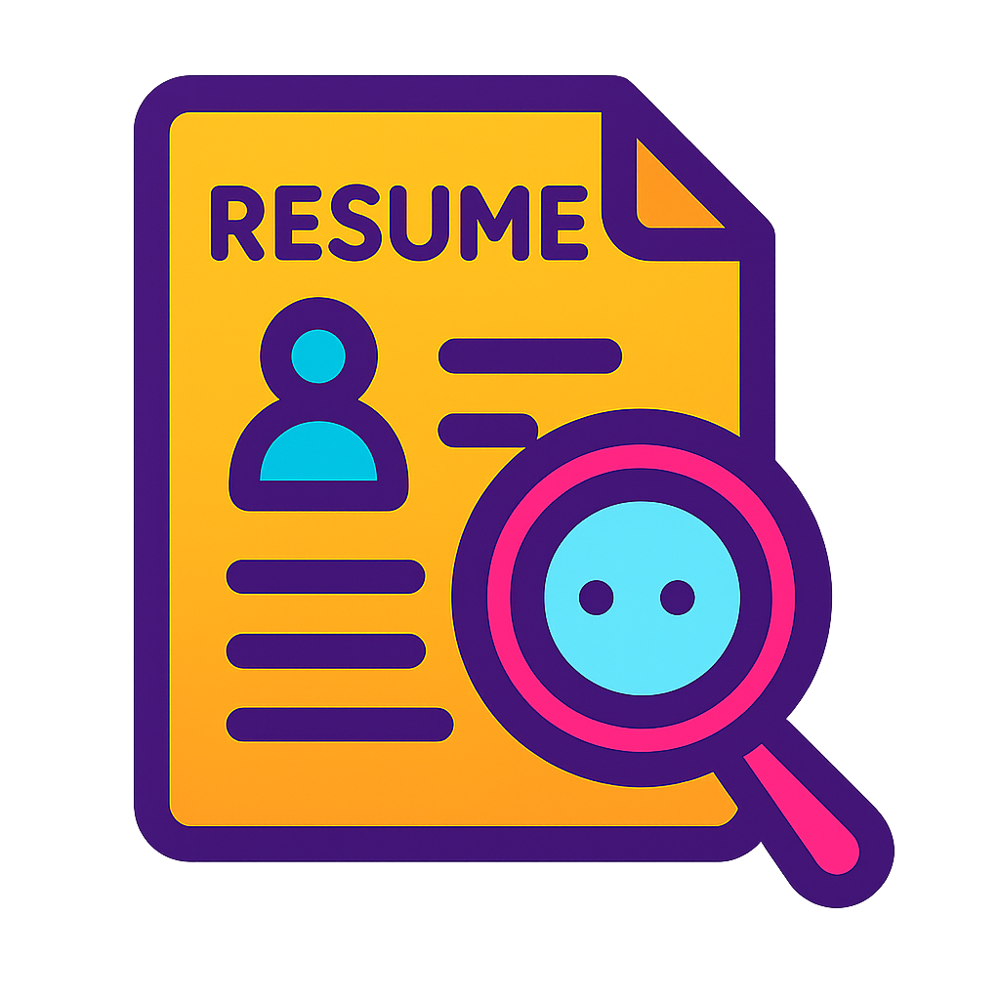

# 🚀 Careerly

Careerly is a career toolkit web app that helps users build resumes, generate cover letters, parse job descriptions, and navigate personalized roadmaps powered by AI tools.

## 🖼️ Screenshots

| Dashboard                            | Cover Letter Tool                          | Resume Parser               |
| ------------------------------------ | ------------------------------------------ | --------------------------- |
|  |  |  |

## ⚙️ Tech Stack

- Next.js 14 (App Router)
- Tailwind CSS
- TypeScript
- Clerk (Authentication + Billing)
- Stripe (Commerce)
- SWR for data fetching
- Vercel (deployment)

## 🔧 Features

- 🧠 AI Resume Suggestions
- 📄 Cover Letter Generator
- 🔍 Resume Parser
- 🗺️ Learning Roadmap Generator
- 🔐 Secure Auth with Clerk

## 🛠️ Getting Started

```bash
git clone https://github.com/pratik-dubey/careerly.git
cd careerly
npm install
npm run dev
```
